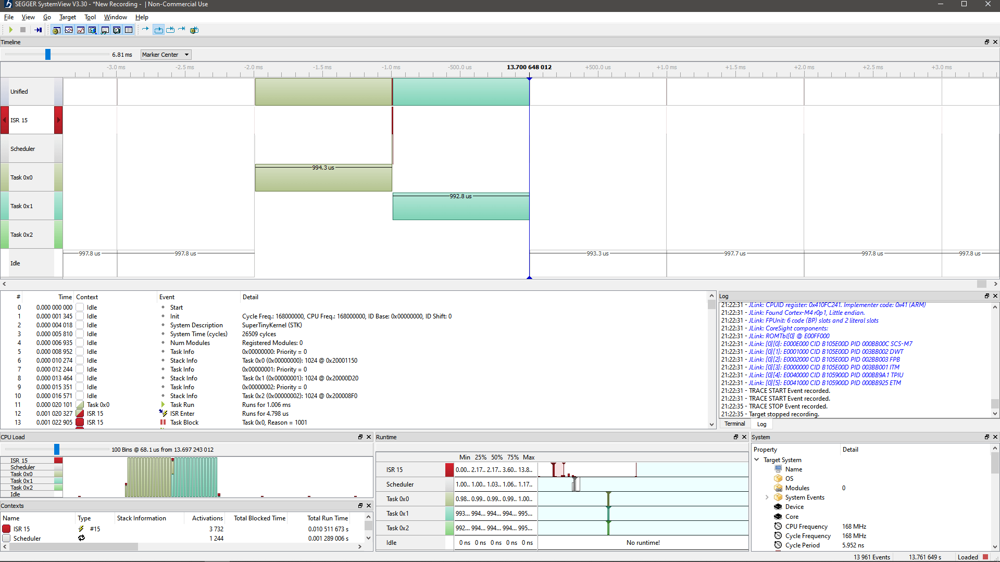

# SuperTinyKernel (STK)

**Minimalistic High-Performance C/C++ RTOS for Embedded Systems**

---

[](https://github.com/SuperTinyKernel-RTOS/stk/blob/main/LICENSE)
[](https://github.com/SuperTinyKernel-RTOS/stk/actions)
[](https://github.com/SuperTinyKernel-RTOS/stk)
[](https://membrowse.com/public/supertinykernel-rtos/stk)

---

## Overview

**SuperTinyKernel (STK)** is a high-performance, bare-metal RTOS designed for resource-constrained environments. By focusing on a preemptive and deterministic thread scheduler rather than peripheral abstraction (HAL), STK provides a lightweight yet robust foundation for multitasking embedded applications where timing and minimal overhead are critical.

STK is implemented in C++ with a clean **Object-Oriented Design** while remaining friendly to embedded developers:
* No aggressive namespace usage
* No dependency on modern C++ features or STL
* No dynamic memory allocation
* Transparent and readable implementation
* Fully-featured C interface for C-only development

It is an [open-source project](https://github.com/SuperTinyKernel-RTOS), navigate its code for more details.

---

## Key Features

| Feature                                | Description                                                                                        |
|----------------------------------------|----------------------------------------------------------------------------------------------------|
| Soft real-time                         | No strict time slots, mixed cooperative (by tasks) and preemptive (by kernel) scheduling           |
| Hard real-time (`KERNEL_HRT`)          | Guaranteed execution window, deadline monitoring by the kernel                                     |
| Static task model (`KERNEL_STATIC`)    | Tasks created once at startup                                                                      |
| Dynamic task model (`KERNEL_DYNAMIC`)  | Tasks can be created and exit at runtime                                                           |
| Rich scheduling capabilities           | All major scheduling strategies are supported: priority-less, fixed-priority or automatic-priority |
| Extensible via C++ interfaces          | Kernel functionality can be extended by implementing available C++ interfaces                      |
| Multi-core support (AMP)               | One STK instance per physical core for optimal, lock-free performance                              |
| Memory Protection Unit (MPU) support   | Supports privileged `ACCESS_PRIVILEGED` and non-privileged tasks `ACCESS_USER`                     |
| Low-power aware                        | MCU enters sleep when no task is runnable (sleeping)                                               |
| Synchronization API                    | Synchronization primitives for building application of any difficulty level                        |
| Tiny footprint                         | Minimal code unrelated to scheduling                                                               |
| Safety-critical systems ready          | No dynamic heap memory allocation (satisfies MISRA C++:2008 Rule 18-4-1)                           |
| C++ and C API                          | Can be used easily in C++ and C projects                                                           |
| Easy porting                           | Requires very small to none BSP surface                                                            |
| Traceable                              | Scheduling is fully traceable with a SEGGER SystemView                                             |
| Development mode (x86)                 | Run the same threaded application on Windows                                                       |
| 100% test coverage                     | Every source-code line of scheduler logic is covered by unit tests                                 |
| QEMU test coverage                     | All repository commits are automatically covered by unit tests executed on QEMU for Cortex-M       |

---

## Modes of Operation

### Soft Real-Time (Default)

* Tasks cooperate using `Sleep()` or `Yield()`
* Timing is a best-effort
* Preemptive scheduling: tasks can not block execution of other tasks even if they do not cooperate (see **Built-in Scheduling Strategies**)
* Dedicated task switching strategies (`SwitchStrategyRoundRobin`, `SwitchStrategyFixedPriority`, `SwitchStrategySmoothWeightedRoundRobin`)

```cpp
// task is added without any time constraints
void AddTask(ITask *user_task)
```

### Hard Real-Time (HRT)

* Separate kernel mode of operation set by the `KERNEL_HRT` flag
* Periodic tasks with strict execution windows
* Tasks must notify kernel when the work is done by using `Yield()`
* Kernel enforces deadlines
* Any violation fails the application deterministically (`ITask::OnDeadlineMissed` callback is called)
* Dedicated HRT task switching strategies (`SwitchStrategyRoundRobin`, `SwitchStrategyRM`, `SwitchStrategyDM`, `SwitchStrategyEDF`)

```cpp
// task is added time constraints: periodicity, deadline and start delay
AddTask(ITask *user_task, Timeout periodicity_tc, Timeout deadline_tc, Timeout start_delay_tc)
```

### Static vs Dynamic

* `KERNEL_STATIC`: tasks are created once at startup, kernel never returns to `main()`.
* `KERNEL_DYNAMIC`: tasks may exit, kernel returns to `main()` when all tasks exit.

---

### Built-in Scheduling Strategies

STK is the only one known RTOS which offers all popular switching strategies which can match any usage scenario:

| Strategy Name                            | Mode       | Description                                                                                                                                                                        |
|------------------------------------------|------------|------------------------------------------------------------------------------------------------------------------------------------------------------------------------------------|
| `SwitchStrategyRoundRobin`               | Soft / HRT | Round-Robin scheduling strategy (Default). Allows 100% CPU utilization by tasks.                                                                                                   |
| `SwitchStrategySmoothWeightedRoundRobin` | Soft       | Smooth Weighted Round-Robin (SWRR). Distributes CPU time proportionally to task weights and avoids execution bursts.                                                               |
| `SwitchStrategyFixedPriority`            | Soft       | Fixed-Priority Round-Robin. Tasks have fixed priorities assigned, same priority tasks are scheduled in a Round-Robin manner. Behavior is similar to FreeRTOS's scheduler.          |
| `SwitchStrategyRM`                       | HRT        | Rate-Monotonic (RM). Prioritizes tasks based on their periodicity (rate).                                                                                                          |
| `SwitchStrategyDM`                       | HRT        | Deadline-Monotonic (DM). Prioritizes tasks based on their deadlines.                                                                                                               |
| `SwitchStrategyEDF`                      | HRT        | Earliest Deadline First (EDF). If a set of tasks can be scheduled to meet their deadlines, EDF will find the way. Supports unpredictable task arrival times with strict deadlines. |
| Custom                                   | Soft / HRT | Custom algorithm implemented via the `ITaskSwitchStrategy` interface.                                                                                                              |

By implementing `ITaskSwitchStrategy` interface you can provide your own unique scheduling strategy without changing anything inside the kernel.

---

### Task Privilege Separation

Starting with ARM Cortex-M3 and all newer cores (M3/M4/M7/M33/M55/...) that implement the Armv7-M or Armv8-M architecture with the **Memory Protection Unit (MPU)**, STK supports explicit privilege separation between tasks.

| Access Mode                                                                      | Privileged (`ACCESS_PRIVILEGED`)                            | Unprivileged (`ACCESS_USER`)                                       |
|----------------------------------------------------------------------------------|-------------------------------------------------------------|--------------------------------------------------------------------|
| CPU privilege level                                                              | Runs in **Privileged Thread Mode**                          | Runs in **Unprivileged Thread Mode**                               |
| Direct peripheral access                                                         | Allowed (normal register/bit-band access)                   | Blocked by the hardware (BusFault on any peripheral access)        |
| Ability to call SVC / trigger PendSV                                             | Yes                                                         | No (but STK services allow Sleep, Delay, Yield, CS, ...)           |
| Ability to execute privileged instructions (CPS, MRS/MSR for control regs, etc.) | Yes                                                         | No                                                                 |
| Typical use case                                                                 | Drivers, hardware abstraction, critical infrastructure code | Application logic, protocol parsers, third-party or untrusted code |

Modern embedded systems increasingly process untrusted or complex data (network/USB packets, sensor data, firmware updates, etc.). By marking tasks that parse potentially attacker-controlled data as `ACCESS_USER`, you get **hardware-enforced isolation**:
- An erroneous or malicious write to a peripheral register immediately triggers a **hard BusFault** instead of silently corrupting hardware state.
- Only explicitly trusted tasks (marked `ACCESS_PRIVILEGED`) are allowed to touch GPIO, UART, SPI, DMA, timers, etc.
- The kernel itself and all STK services remain fully functional for unprivileged tasks (`Sleep`, `Yield`, `CriticalSection`, TLS, etc.).

#### Example

```cpp
// Trusted driver task – needs direct hardware access
class DriverTask : public stk::Task<256, ACCESS_PRIVILEGED> { ... };

// Application task that parses USB or network data – runs unprivileged
class ParserTask : public stk::Task<512, ACCESS_USER> { ... };
```

---

### Multi-Core Support

STK supports multicore embedded microcontrollers (e.g., ARM Cortex-M55, dual-core Cortex-M33/M7/M0, or multicore RISC-V devices) through a **per-core instance model** (Asymmetric Multi-Processing). 

AMP design delivers maximum performance while keeping STK kernel extremely lightweight:

| Feature                    | Description                                                                              |
|----------------------------|------------------------------------------------------------------------------------------|
| Zero intercore overhead    | No cross-core communication inside STK itself                                            |
| Minimal latency            | Scheduling decisions are local to the core                                               |
| Full cache efficiency      | All kernel data structures stay in the local core’s L1 cache                             |
| Independent timing domains | One core can run hard real-time tasks while another runs soft real-time or dynamic tasks |
| Simple and predictable     | No complex SMP synchronization logic required in the kernel                              |
| No core congestion         | Highest possible performance and deterministic timing on each individual core            |

STK provides a rich set of synchronization primitives (see [stk/sync](https://github.com/SuperTinyKernel-RTOS/stk/tree/main/stk/include/sync)) which are suitable for multicore synchronization with multiple STK instances.

#### Usage Example (Dual-Core System)

```cpp
void start_core0()
{
    // Core 0 – Real-time control tasks
    static stk::Kernel<KERNEL_STATIC, 8, stk::SwitchStrategyRoundRobin, PlatformDefault> kernel_core0;

    kernel_core0.Initialize(PERIODICITY_1MS); // Hard real-time tick
    kernel_core0.AddTask(&motor_control_task);
    kernel_core0.AddTask(&sensor_task);
    // ...
    kernel_core0.Start();
}

void start_core1()
{
    // Core 1 – Communication & logging tasks
    static stk::Kernel<KERNEL_DYNAMIC, 6, stk::SwitchStrategyRoundRobin, PlatformDefault> kernel_core1;

    kernel_core1.Initialize(PERIODICITY_10MS); // Softer timing
    kernel_core1.AddTask(&ethernet_task);
    kernel_core1.AddTask(&logging_task);
    // ...
    kernel_core1.Start();
}
```

There is a dual-core example for Raspberry Pico 2 W board with RSP2350 MCU in `build/example/project/eclipse/rpi/blinky-smp-rp2350w` directory.

---

## Hardware Support

### CPU Architectures

* ARM Cortex-M (ARMv6-M, ARMv7-M, ARMv7E-M, ARMv8-M, ARMv8.1-M)
* RISC-V RV32I (RV32IMA_ZICSR)
* RISC-V RV32E (RV32EMA_ZICSR) — including very small RAM devices

### Floating-point

* Soft
* Hard

---

## Dependencies

* CMSIS (ARM platforms only)
* MCU vendor BSP (NXP, STM, RPI, etc.)

> **Note:** A minimal set of CMSIS/BSP API is used by STK.

---

## Dedicated C interface

For a seamless integration with C projects STK provides a dedicated, fully-featured C interface. See [interop/c](https://github.com/SuperTinyKernel-RTOS/stk/tree/main/interop/c) for more details and example.

---

## Synchronization API

STK provides a feature-rich synchronization API which is located in [stk/sync](https://github.com/SuperTinyKernel-RTOS/stk/tree/main/stk/include/sync) and resides in a dedicated namespace `stk::sync`. It is a high-performance framework designed for both single-core and multicore embedded systems and provides a robust mechanism for inter-task and inter-core communication.

| Primitive                 | Description                                                                                                                                                                                     |
|---------------------------|-------------------------------------------------------------------------------------------------------------------------------------------------------------------------------------------------|
| `hw::CriticalSection`     | Low-level primitive (including RAII version `hw::CriticalSection::ScopedLock`) that ensures atomicity by preventing preemption. Always available and independent of `KERNEL_SYNC` mode.         |
| `hw::SpinLock`            | High-performance non-recursive primitive for short critical sections. A key primitive for inter-core synchronization. Always available and independent of `KERNEL_SYNC` mode.                   |
| `sync::ConditionVariable` | Monitor-pattern signaling used with a `Mutex`. Allows tasks to sleep until a specific condition is met, with atomic unlock/relock semantics.                                                    |
| `sync::Event`             | State-based signaling object. Supports manual or auto-reset behavior to wake one or multiple tasks upon a specific system occurrence.                                                           |
| `sync::Mutex`             | Re-entrant recursive mutual exclusion primitive. Ensures exclusive resource access with ownership tracking to prevent unauthorized release.                                                     |
| `sync::SpinLock`          | High-performance recursive primitive for short critical sections. Uses atomic busy-waiting with a configurable spin-count threshold that cooperatively yields the CPU to prevent system stalls. |
| `sync::Semaphore`         | Counting primitive for resource throttling. Features a "Direct Handover" policy, passing tokens directly to waiting tasks to ensure deterministic behavior.                                     |
| `sync::Pipe`              | Thread-safe FIFO ring buffer for inter-task data passing. Supports blocking single and bulk I/O with zero dynamic memory allocation.                                                            |
| Custom                    | Extensible architecture where any class inheriting from `ISyncObject` can implement custom synchronization logic integrated with the kernel scheduler.                                          |

> **Note:** Synchronization can be enabled in the kernel selectively by adding `KERNEL_SYNC` flag. If application does not need `sync` primitives and `KERNEL_SYNC` is not set to the kernel then synchronization-related implementation is stripped by the compiler saving FLASH and RAM.

---

## Traceable by SEGGER SystemView

Scheduling can be analyzed be the [SEGGER SystemView](https://www.segger.com/products/development-tools/systemview).

There is a ready to try Blinky example with SEGGER SystemView tracing enabled: `build\example\project\eclipse\stm\blinky-stm32f407g-disc1-segger`



---

## Development Mode (x86)

STK includes a full scheduling emulator for Windows to speed up a prototype development:
* Run the same embedded application on x86
* Debug threads using Visual Studio or Eclipse
* Perform unit testing without hardware
* Mock or simulate peripherals

---

## Test Boards

STK has been tested on the following development boards:

* STM STM32F0DISCOVERY (Cortex-M0)
* STM NUCLEO-F103RB (Cortex-M3)
* NXP FRDM-K66F (Cortex-M4F)
* STM STM32F4DISCOVERY (Cortex-M4F)
* NXP MIMXRT1050 EVKB (Cortex-M7)
* Raspberry Pi Pico 2 W (Cortex-M33 / RISC-V variant)

> **Note:** The list of tested boards does not limit STK’s compatibility. STK does not depend on a specific board and relies only on the underlying CPU architecture. As long as target CPU is supported, STK can be integrated with your hardware platform.

---

## Test Coverage

| Coverage                  | Description                                       |
|---------------------------|---------------------------------------------------|
| Platform-independent code | 100% unit test coverage                           |
| Platform-dependent code   | tested under QEMU for each supported architecture |

---

## Benchmark

Board: STM32F407G-DISC1, MCU: STM32F407VG (Cortex-M4 168MHz).
Update: Feb 2026

This table compares **SuperTinyKernel (STK) v.1.04.2** and **FreeRTOS V10.3.1** across two compiler optimization levels: `-Os` and `-Ofast`. The workload consists of a CRC32-based synthetic task running across multiple tasks/threads to measure scheduling overhead and timing determinism. Benchmark projects are located in `build/benchmark/eclipse` and the benchmark suite is located in `build/benchmark/perf`.

The benchmark suite uses CRC32 hash calculations as the task payload. The score represents the number of CRC32 calculations performed by the task within a fixed time window. A higher score indicates a more efficient scheduler, meaning the tasks have more available CPU time.

| Kernel       | Tasks | Opt      | Throughput  | Average  | Jitter  | Flash Size  | RAM Used   |
|--------------|-------|----------|-------------|----------|---------|-------------|------------|
| **STK**      | 16    | `-Ofast` | **993,057** | 62,066   | **753** | 25.3 KB     | **7.0 KB** |
| **FreeRTOS** | 16    | `-Ofast` | 965,991     | 60,374   | 908     | 13.7 KB     | 8.8 KB     |
| **STK**      | 16    | `-Os`    | **752,040** | 47,002   | **425** | 18.5 KB     | **7.1 KB** |
| **FreeRTOS** | 16    | `-Os`    | 731,957     | 45,747   | 471     | **12.2 KB** | 11.0 KB    |
| ---          | ---   | ---      | ---         | ---      | ---     | ---         | ---        |
| **STK**      | 8     | `-Ofast` | **989,026** | 123,628  | 867     | 25.3 KB     | **7.0 KB** |
| **FreeRTOS** | 8     | `-Ofast` | 932,579     | 116,572  | **615** | 13.7 KB     | 8.8 KB     |
| **STK**      | 8     | `-Os`    | **752,875** | 94,109   | 660     | 18.5 KB     | **7.1 KB** |
| **FreeRTOS** | 8     | `-Os`    | 710,090     | 88,761   | **466** | **12.2 KB** | 11.0 KB    |
| ---          | ---   | ---      | ---         | ---      | ---     | ---         | ---        |
| **STK**      | 4     | `-Ofast` | **989,705** | 247,426  | 742     | 25.3 KB     | **7.0 KB** |
| **FreeRTOS** | 4     | `-Ofast` | 881,079     | 220,269  | **690** | 13.7 KB     | 8.8 KB     |
| **STK**      | 4     | `-Os`    | **753,302** | 188,325  | 565     | 18.5 KB     | **7.1 KB** |
| **FreeRTOS** | 4     | `-Os`    | 670,867     | 167,716  | **504** | **12.2 KB** | 11.0 KB    |

### Conclusion
* **Throughput:** STK tasks consistently outperform FreeRTOS tasks, achieving up to **31% higher throughput** in low-task counts and maintaining a lead even at 16 tasks.
* **Memory Usage:** STK leads in RAM optimization, utilizing only ~7 KB of RAM compared to FreeRTOS's ~9-11 KB that is **25-55% lower RAM usage** in general. Although the C++ template architecture results in a larger FLASH footprint (~25 KB vs ~13 KB), this trade-off is what enables the highly specialized, zero-overhead execution path that defines STK's speed. `-Ofast` reduces RAM usage for both kernels compared to `-Os`.
* **Scheduling Overhead:** STK's total throughput remains remarkably **flat** as task count increases, showing **minimal context-switching friction** compared to FreeRTOS.
* **Determinism:** In high-stress scenarios (16 tasks, `-Ofast`), STK provides **~17% lower jitter**, making it superior for timing-sensitive applications.

---

## Quick Start (1 minute)

### 1. Clone repository

```bash
git clone https://github.com/SuperTinyKernel-RTOS/stk.git
cd stk
```

### 2. Build example for x86 development mode

You can build and run examples **without any hardware** on Windows.

with Visual Studio:

```bash
cd build/example/project/msvc
```
* `blinky` – emulates toggling of Red, Green, Blue LEDs
* `critical_section` – demonstrates support for Critical Section synchronization primitive
* `tls` - demonstrates the use of Thread-local storage (TLS)

with Eclipse CDT:

```bash
cd build/example/project/eclipse
```
* `blinky-mingw32` – emulates toggling of Red, Green, Blue LEDs

To import project into Eclipse workspace:

```
File → Import... → Existing Projects into Workspace → Select root directory → Browse... → build/example/project/eclipse/blinky-mingw32
```

### 3. Run on a hardware

* Import the STM32, RPI (Raspberry Pico) or NXP example in Eclipse CDT IDE or MCUXpresso IDE
* Example folders provide Eclipse `.launch` files for launching on QEMU, Segger J-Link, OpenOCD 
* Build and flash your target MCU

---

## Building and Running Examples

> You can use your own tools, below specified tools are just for a quick evaluation of STK's functionality using the provided examples.

### Required tools for building examples

For STM32, RPI platforms:
* Eclipse Embedded CDT
* xPack GNU ARM Embedded GCC
* xPack QEMU ARM emulator

For NXP platforms:
* MCUXpresso IDE (includes GCC)

For RISC-V platforms:
* xPack GNU RISC-V Embedded GCC
* xPack QEMU RISC-V

> If you are targeting only ARM, RISC-V tools are not required.

### Examples

All examples are located in `build/example/project/eclipse` folder.

Examples are grouped by platform:
* `stm` – STM32, for QEMU or hardware
* `rpi` – Raspberry Pico
* `risc-v` - RISC-V, for QEMU or hardware
* `x86` – Windows emulator

#### Import into Eclipse CDT

```
File → Import... → Existing Projects into Workspace → Select root directory → build/example/project/eclipse
```

STM32 and Raspberry Pico examples include SDK files located in `deps/target` folder.

#### NXP Examples

Located in `build/example/project/nxp-mcuxpresso` folder.

Compatible with:
* Kinetis K66/K26
* i.MX RT1050
* other compatible NXP MCUs with ARM Cortex-M0/M3/M4/M7/M33/...

---

#### Example Code

Below example toggles RGB LEDs on a development board. Each LED is controlled by its own thread, switching at 1s intervals:

```cpp
#include <stk_config.h>
#include <stk.h>
#include "example.h"

static volatile uint8_t g_TaskSwitch = 0;

template <stk::EAccessMode _AccessMode>
class MyTask : public stk::Task<256, _AccessMode>
{
    uint8_t m_taskId;

public:
    MyTask(uint8_t taskId) : m_taskId(taskId) {}
    stk::RunFuncType GetFunc() { return &Run; }
    void *GetFuncUserData() { return this; }

private:
    static void Run(void *user_data)
    {
        ((MyTask *)user_data)->RunInner();
    }

    void RunInner()
    {
        uint8_t task_id = m_taskId;

        while (true)
        {
            if (g_TaskSwitch != task_id)
            {
                stk::Sleep(10);
                continue;
            }

            switch (task_id)
            {
            case 0:
                LED_SET_STATE(LED_RED, true);
                LED_SET_STATE(LED_GREEN, false);
                LED_SET_STATE(LED_BLUE, false);
                break;
            case 1:
                LED_SET_STATE(LED_RED, false);
                LED_SET_STATE(LED_GREEN, true);
                LED_SET_STATE(LED_BLUE, false);
                break;
            case 2:
                LED_SET_STATE(LED_RED, false);
                LED_SET_STATE(LED_GREEN, false);
                LED_SET_STATE(LED_BLUE, true);
                break;
            }

            stk::Sleep(1000);
            g_TaskSwitch = (task_id + 1) % 3;
        }
    }
};

static void InitLeds()
{
    LED_INIT(LED_RED, false);
    LED_INIT(LED_GREEN, false);
    LED_INIT(LED_BLUE, false);
}

void RunExample()
{
    using namespace stk;

    InitLeds();

    static Kernel<KERNEL_STATIC, 3, SwitchStrategyRoundRobin, PlatformDefault> kernel;
    static MyTask<ACCESS_PRIVILEGED> task1(0), task2(1), task3(2);

    kernel.Initialize(PERIODICITY_DEFAULT);

    kernel.AddTask(&task1);
    kernel.AddTask(&task2);
    kernel.AddTask(&task3);

    kernel.Start();

    assert(false);
    while (true);
}
```

---

## Adding STK to your project

### Add using Git & CMake:

#### 1. Add STK to your project using Git & CMake

You can include STK in your project using `git submodule` or by copying the source into a `libs/` or `third_party/` folder:
```bash
# Example: using git submodule
cd your-project
git submodule add https://github.com/SuperTinyKernel-RTOS/stk.git libs/stk_scheduler
git submodule update --init
```

#### 2. Modify your `CMakeLists.txt`

Add the STK directory and link against STK:
```cmake
# In your project CMakeLists.txt

# 1. Add STK as a subdirectory
add_subdirectory(libs/stk_scheduler/stk)

# 2. Link STK into your executable or firmware target
target_link_libraries(your_firmware_target PUBLIC stk)

# 3. Include STK headers
target_include_directories(your_firmware_target
    PUBLIC
    ${CMAKE_SOURCE_DIR}/libs/stk_scheduler/stk/include
)
```

#### 3. Build

Run your normal build procedure. STK will now be compiled and linked with your project.

#### 4. Initialize STK in your code

```cpp
#include "stk.h"
// ...
static Kernel<KERNEL_STATIC, 3, SwitchStrategyRoundRobin, PlatformDefault> kernel;
// add tasks, start scheduling …
```

#### 5. Testing & Simulation

- Use STK’s x86 development mode for rapid development
- Deploy to MCU when ready

### Alternative Method: Copy STK directly into project files:

STK can be integrated by simply copying its source files from `stk/` folder.

This method is suitable for:
- vendor-delivered projects (MCUXpresso, STM32CubeIDE, Keil, IAR, ...)
- closed-source or isolated environments
- projects without CMake or external dependency management

#### 1. Copy STK folders

From the root of STK repository, copy:
```
stk/
```

into your project's source tree, for example:
```
your_project/
  src/
  drivers/
  libs/
    stk/   ← copied here
```

#### 2. Add STK include paths

Add the following include path to your project configuration:
```
your_project/libs/stk/include
```

In CMake:
```cmake
target_include_directories(your_firmware_target
    PUBLIC
    ${CMAKE_SOURCE_DIR}/libs/stk/include
)
```

In GCC/Makefile:
```make
-Ilibs/stk/include
```

#### 4. Create stk_config.h and add it to includes

For example, for ARM Cortex-M4 project:
```cpp
#ifndef STK_CONFIG_H_
#define STK_CONFIG_H_

#include "cmsis_device.h"
#include "core_cm4.h"

// Undefine if MCU is Arm Cortex-M4
#define _STK_ARCH_ARM_CORTEX_M

#ifdef _STK_ARCH_ARM_CORTEX_M
    // Redefine if SysTick handler name is different from SysTick_Handler
    //#define _STK_SYSTICK_HANDLER SysTick_Handler

    // Redefine if PendSv handler name is different from PendSV_Handler
    //#define _STK_PENDSV_HANDLER PendSV_Handler

    // Redefine if SVC handler name is different from SVC_Handler
    //#define _STK_SVC_HANDLER SVC_Handler
#endif

#endif /* STK_CONFIG_H_ */
```

#### 5. Add STK source files to build

You must compile STK core sources from:
```
stk/src
```

Minimum required sources:
```
stk/src/stk.cpp
stk/src/arch/<your-platform>/...
```

Example (GCC, ARM Cortex-M MCU):
```make
SRCS += \
  libs/stk/src/stk.cpp \
  libs/stk/src/arch/arm/cortex-m/stk_arch_arm-cortex-m.cpp
```

#### 4. Build

Build your project normally — STK will now be compiled together with it.

---

## Porting & Extending

Porting STK to a new platform is straightforward. Platform-dependent files are located in:
```
stk/src/arch
stk/include/arch
```

STK's OOD design allows easy extension of its functionality. For example, you can develop and attach your own scheduling algorithm by inheriting `ITaskSwitchStrategy` interface.

---

## License

STK is released under the **MIT Open Source License**. 

You may freely use it in projects of any type:
* Commercial
* Closed-Source
* Open-Source
* Academic
* etc. (if in doubt, please contact us)

---

## 🚀 Professional Services & Commercial Licensing

While **SuperTinyKernel (STK)** is provided under the permissive MIT license, we offer dedicated professional services for organizations integrating STK into production-grade, mission-critical, or regulated environments.

### 🛡️ Legal & Compliance
* **Warranty of Title:** Full intellectual property (IP) indemnification and provenance guarantees required by corporate legal departments.
* **Safety-Critical Compliance:** Expert assistance in achieving **ISO 26262** (Automotive), **IEC 61508** (Industrial), or **DO-178C** (Aerospace) certification for STK-based systems.
* **Custom Licensing:** Tailored Enterprise License Agreements (ELA) for organizations with strict open-source procurement policies.
* **Audit & Due Diligence:** Code audit and licensing assessment to satisfy corporate or regulatory requirements.

### 🛠️ Engineering & Optimization
* **Architecture Porting:** Custom development for specialized ARM, RISC-V, or other architectures, including embedded SoCs and microcontrollers.
* **Real-Time Performance Tuning:** Hard real-time optimization, latency profiling, and jitter reduction for mission-critical applications.
* **Custom Driver & Peripheral Integration:** STK integration with complex peripherals (High-Speed USB, I2S/TDM audio, networking stacks, DMA engines, etc.).

### 📞 Enterprise Support & Maintenance
* **SLA-Backed Support:** Guaranteed response times for technical inquiries and critical bug fixes, with priority escalation paths.
* **Architectural Consulting:** Deep-dive code reviews, system design guidance, and reliability analysis for your firmware.
* **Long-Term Maintenance Contracts:** Versioned updates, patch management, and minor feature requests for commercial products.
* **Training & Knowledge Transfer:** Remote workshops, RTOS best practices, and team training for engineers working with STK.

**For inquiries, contact:** [stk@neutroncode.com](mailto:stk@neutroncode.com)
